# 网络安全第一次实验：基于 VirtualBox 的网络攻防基础环境搭建

## 实验目的

- 掌握 Virtual Box 虚拟机的安装与使用；
- 掌握 Virtual Box 的虚拟网络类型和按需配置；
- 掌握 Virtual Box 的虚拟硬盘多重加载；

## 实验环境

以下是本次实验需要使用的网络节点说明和主要软件举例：

- VirtualBox 虚拟机
- 攻击者主机（Attacker）：Kali 
- 网关（Gateway）：Debian 
- 靶机：xp-sp3 / Kali / Debian

## 实验要求

- 虚拟硬盘配置成多重加载；

- 搭建满足如下拓扑图所示的虚拟机网络拓扑；


- 完成以下网络连通性测试；

  -  靶机可以直接访问攻击者主机
  - 攻击者主机无法直接访问靶机
  - 网关可以直接访问攻击者主机和靶机
  - 靶机的所有对外上下行流量必须经过网关
  - 所有节点均可以访问互联网

  ## 实验步骤

  ### 1.配置虚拟硬盘多重加载

  步骤图示如下：

  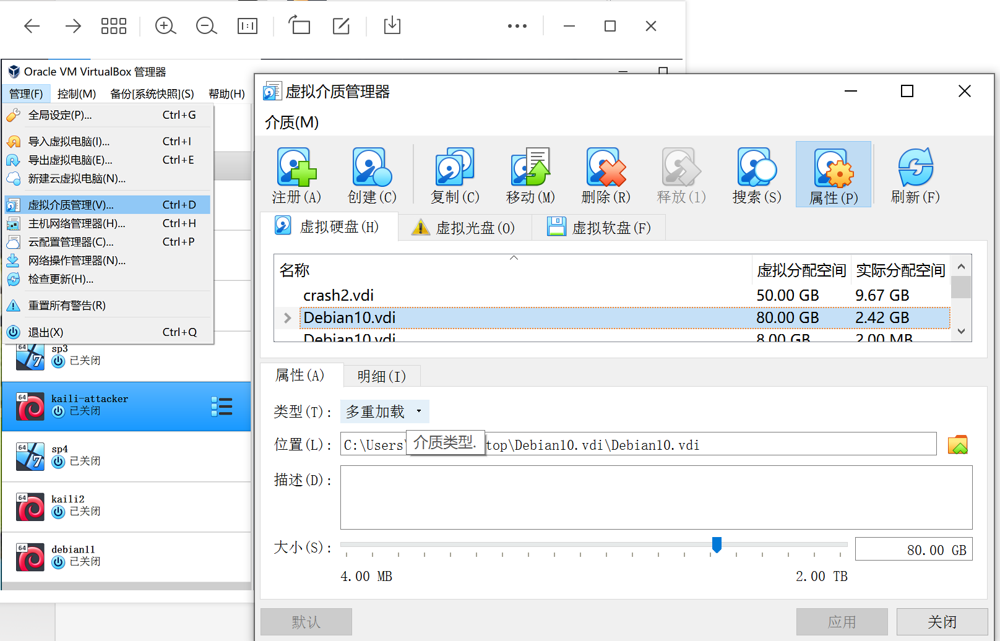

### 2.搭建虚拟机网络拓扑

#### 打开每台虚拟机，在设置中进行网卡的配置

- **Gateway网关**网卡配置（4块）
  - 第一块：NAT网络；
  - 第二块：主机（Host-Only）网络；
  - 第三块：内部网络intnet1，搭建局域网1；
  - 第三块：内部网络intnet2，搭建局域网2；
  - 在此界面对网卡进行依次设置，过程省略；

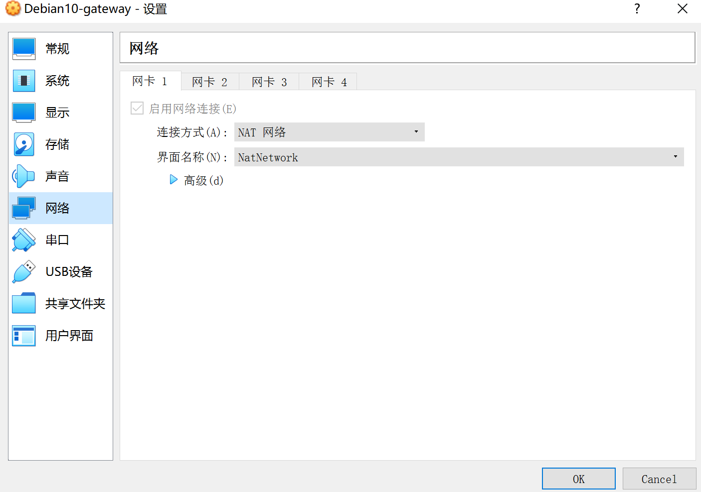

- **Attacker攻击者**需三块网卡
  - 第一块：NAT网络；
  - 第二块：主机（Host-Only）网络；
  - 第三块：主机（Host-Only）网络；**！与第二块不一样**；
- **其他的实验受害主机**都只需要一块网卡
  - 分为两组，使得不同的实验受害主机在不同的局域网里；
  - Windows xp1 与 kali 2号在第一局域网（intnet1）； 
  - Windows xp2 与 debian 2号在第二局域网（intnet2）；

### 3.开始进行主机间的互联

- 测试**第一局域网（intnet1）**内的主机与Attacker的连通性

  - 靶机可直接访问Attacker

    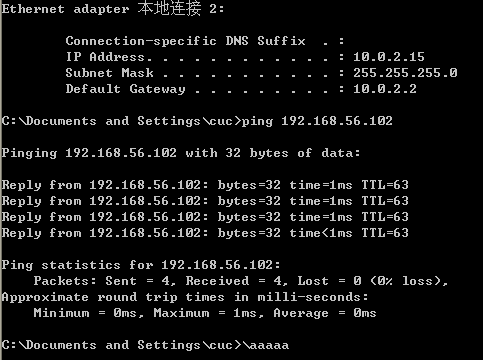

  - Attacker不可直接访问靶机

  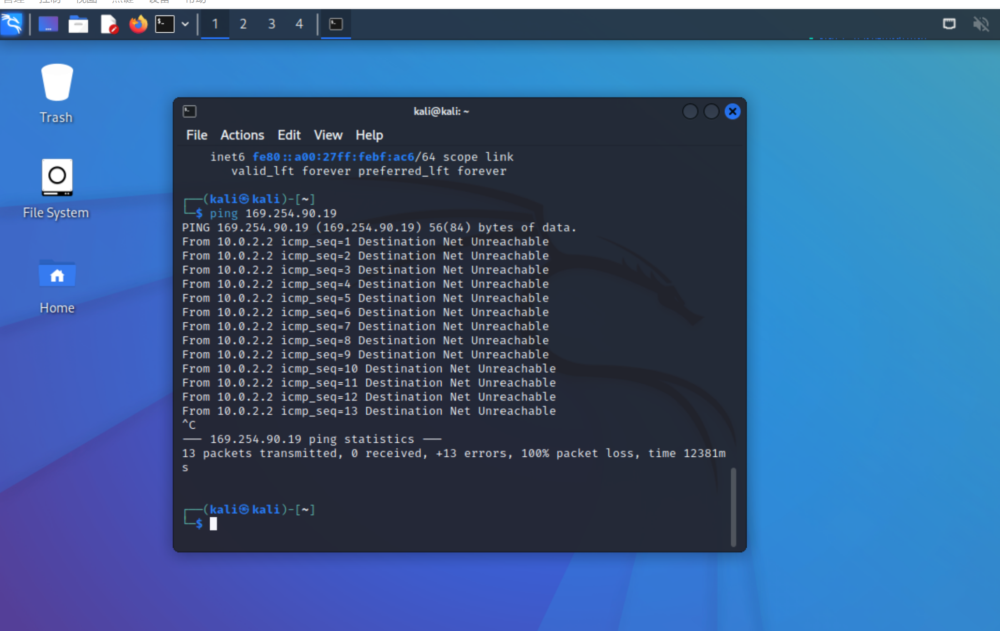

- 测试**第二局域网（intnet2）**内的主机与Attacker的连通性

  - 靶机可直接访问Attacker

    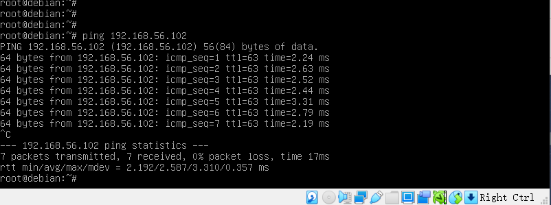

  - Attacker不可直接访问靶机

    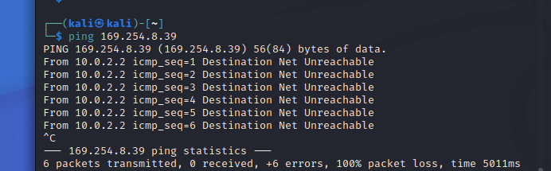

- 测试**网关**可以直接访问攻击者主机和靶机

  - 网关访问Attacker

    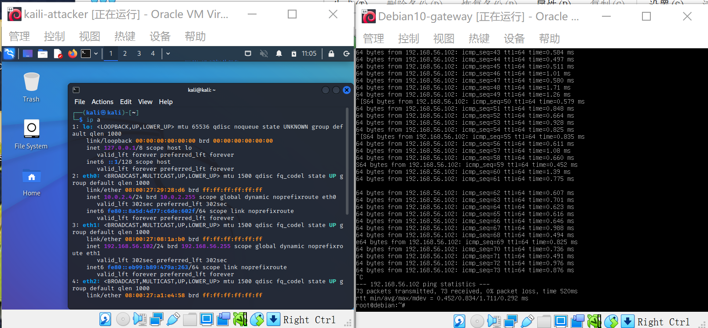

  - 网关访问第一局域网（intnet1）靶机

    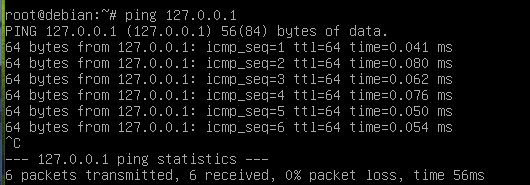

  - 网关访问第二局域网（intnet2）靶机

    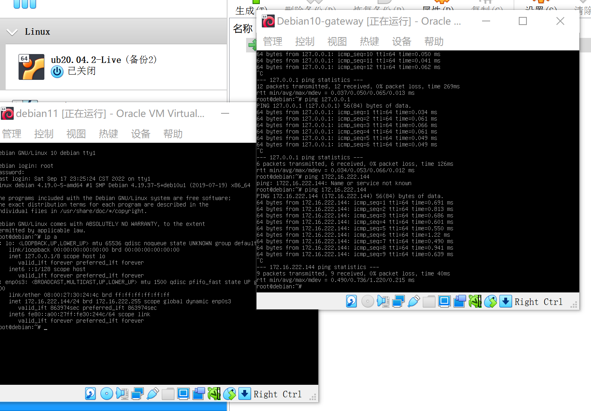

### 4.验证靶机的所有对外上下行流量必须经过网关

**验证思路：**让靶机与互联网进行互通，在互通的过程中用网关进行抓包，如果靶机发送的所有包都能被网关抓到，则说明靶机的所有对外上下行流量必须经过网关。

- 第一局域网（intnet1）靶机

  - 联通互联网并用网关抓包（抓包语句：`sudo tcpdump -c 5`）

    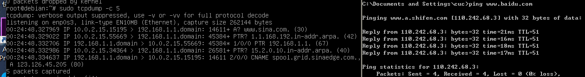

- 第二局域网（intnet2）靶机

  - 联通互联网并用网关抓包（抓包语句：`sudo tcpdump -c 5`）

    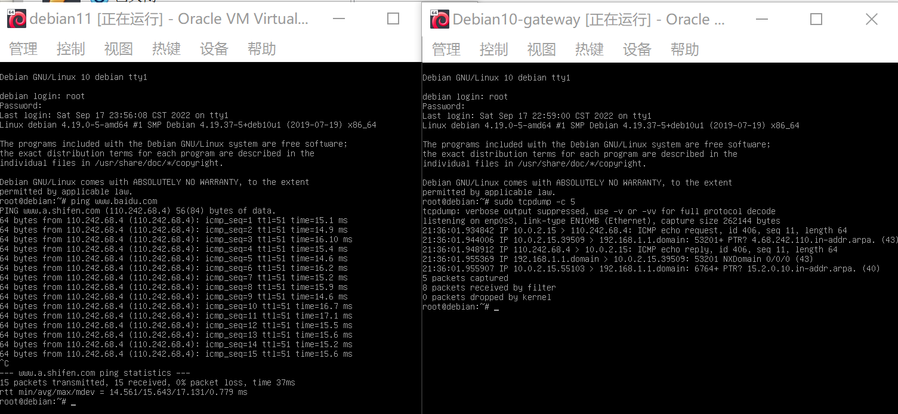

- 抓包数据文件复制到主机用WireShark分析

  ```shell
  # 安装tcpdump，利用tmux获取抓包数据
  apt install tcpdump
  apt update && apt install tmux
  
  # 抓包
  tcpdump -i enp0s9 -n -w 20220918.1.pcap # 设置抓包的网卡端口
  ls # 查看抓包得到的数据
  ```

  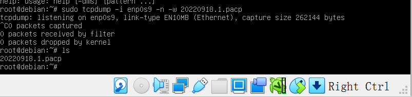

  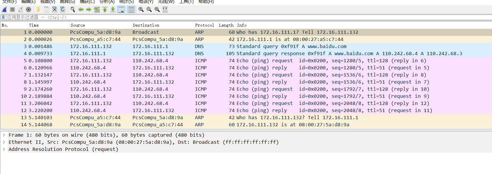

### 5.所有节点均可以访问互联网

- Attacker可正常访问互联网

  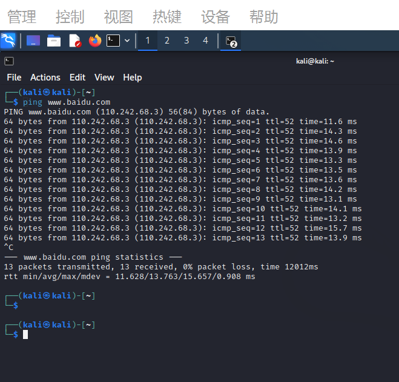

- 第一局域网（intnet1）靶机可正常访问互联网

  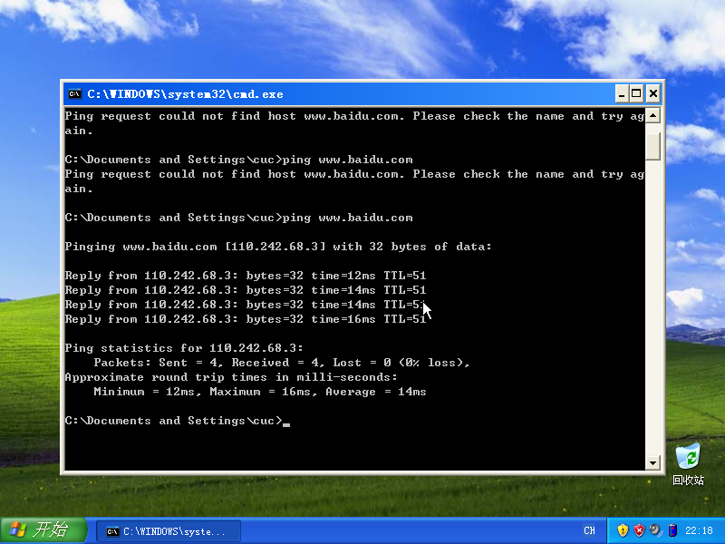

- 第二局域网（intnet2）靶机可正常访问互联网

  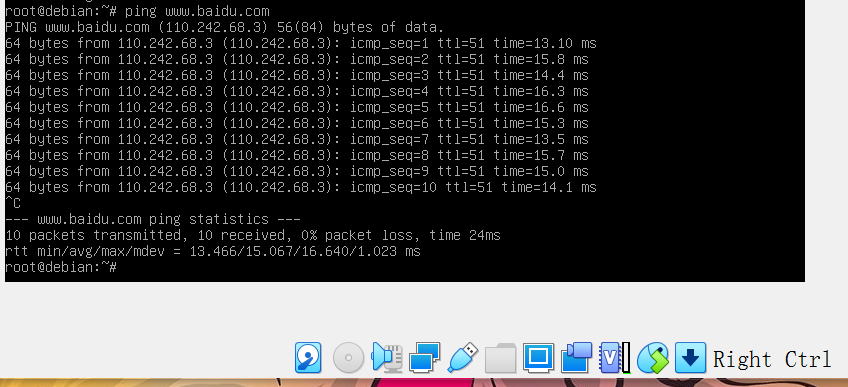

- 网关可正常访问互联网

  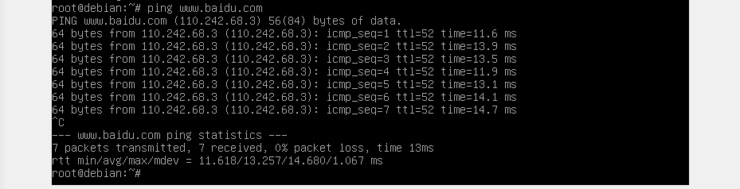

## 实验遇到的问题与解决方案

1. 网络配置中，NAT网络无法指定界面的名称。查找资料，利用全局设定解决该报错。
2. 实验过程中，有几个虚拟机无法正常打开。彻底删除掉所有文件后，进行重新导入，导入时注意清空原有盘片。
3. 在进行主机互联时，有时候总是ping不通。后来经过查资料，了解到用哪个主机去ping就要关闭它的防火墙。
4. 使用scp语句时频繁出错，查阅以往资料解决。

## 参考链接

- [网卡配置](https://blog.csdn.net/hexf9632/article/details/110197530)
- [virtual box安装Linux系统并关闭防火墙](https://mbd.baidu.com/ma/s/nShWHTqN)

